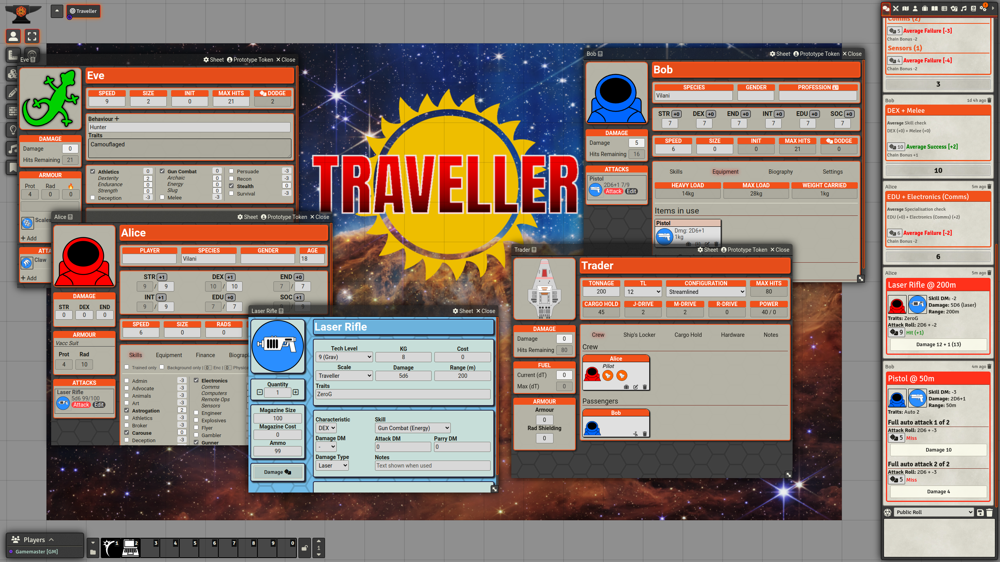

# Mongoose Traveller for FoundryVTT

**BRANCH TO CHANGE SYSTEM IDENTIFIER:** This is an incompatible breaking change with previous versions.

This is an implementation of Mongoose Traveller 2e for FoundryVTT. It currently supports Foundry v11.
it is currently in beta, so suggestions and bug reports are greatly appreciated. The basic game rules
are currently supported, but new features are being added all the time.



Currently, it provides support for:
* Character sheets for Travellers (PCs), NPCs and Creatures are provided.
* A full built-in list of skills for characters, along with Mongoose 2e rules for specialities and professions.
* Skills can be dragged to the hot bar for quick access.
* Attack rolls, with damage and effect, stun damage, AP and other weapon attributes.
* Augments, including Expert Systems, augmented armour and cyberwear.
* Support for background and alien race packages.
* Career terms for character generation, including allies, contacts and enemies.

Note that it does not currently include 'content' such as equipment lists.

Support for spacecraft is currently in progress, with rules for cargo, starship hardware, adding crew and passengers
and specifying actions for crew roles.

## How to Build

### Compendium Packs

Objects in compendium packs are stored as individual JSON files.
  * Use `mkpacks pack` to convert from JSON to binary DB format.
  * Use `mkpacks unpack` to convert from binary DB format to JSON.

These scripts assume that the foundry CLI `fvtt` is present and
configured. The `dataPath` should be set to the local mgt2 directory.

e.g.

```
fvtt configure set dataPath $PWD/mgt2e/
```

### Releases

Use `release.sh` to create a release file. One of the following options must be used:
* -s Keep the version the same
* -p Increment the patch release version (0.1.2 becomes 0.1.3)
* -m Increment the minor release version (0.1.2 becomes 0.2.0)
* -M Increment the major release version (0.1.2 becomes 1.0.0)

You can also add `-b` which will create a new Git branch based on the new version number, ready for
branching a release.

A release runs `mkpacks unpack` followed by `mkpacks pack`, so it is recommended that compendiums are
locked and Foundry is shutdown when this is done. If not, changes in the Foundry database may be lost.

Use `mkpacks unpack` to export compendium packs from Foundry into source files. This _must_ be run
when the compendium packs are locked and Foundry has been closed down. If this is not the case, then
new changes to the packs will not be exported.

Use `mkpacks pack` to import compendium packs from source files into Foundry. This will overwrite
anything in the Foundry database files with what is in the source files.

## Object Types

The main supported object types defined in the system are:

### Actors

  * Traveller - A player character
  * NPC - Cut down version of a Traveller
  * Creature - Creatures with even fewer details
  * Spacecraft - A spacecraft, currently partially supported.
  * Package - Contains package of skills, items and attributes for building NPCs or Travellers from.

### Items

  * General Item - Normal equipment without special rules.
  * Weapon - Weapons, used by people and creatures.
  * Armour - Armour, used by people and creatures.
  * Augmentation - Expert Systems, Augments and other things that provide bonuses
  * Career Term - Represents a Term during character creation.
  * Associate - Represents a contact, ally, enemy or rival gained during character creation.
  * Cargo - Goods to be bought and sold, carried on spacecraft.
  * Spacecraft Hardware - Items a spacecraft is built from.
  * Crew Roles - Specify roles for crew members of a starship or vehicle.


## Licenses

Code is BSD licensed, based on boilerplate Foundry code from https://github.com/asacolips-projects/boilerplate

Some icons are taken from svgicons.com and game-icons.net. See the READMEs in those directories for details.

Starship icons are drawn by Samuel Penn, and available under a CC0 license.
